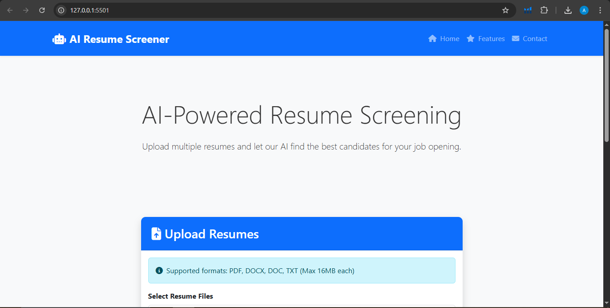

# 🧠 AI Resume Screener

An intelligent resume screening web application built using **Python**, **Flask**, **HTML/CSS**, **JavaScript**, and **C#**.  
It helps recruiters or HR teams upload resumes and screen candidates based on job roles and required skills using natural language processing (NLP) techniques.

📷 Screenshots

 
## 🔍 Features

- 📄 Upload resumes in `.pdf` or `.docx` format
- 🧠 Extract and process resume text using **Spacy**
- 🧪 Match resumes to job descriptions using **Scikit-learn**
- 📊 View ranked results based on similarity
- 🖥️ Responsive web interface with **HTML, CSS, JavaScript**
- 🧰 Backend built in **Flask (Python)**

## 📁 Project Structure
resume-screener/
│
├── app.py # Main Flask app
├── algorithms.py # Resume processing logic
├── requirements.txt # Python packages
├── /templates # HTML files (Jinja2 templates)
│ ├── index.html
│ └── results.html
├── /static # CSS, JS, images
│ └── style.css
└── uploads/ # Temporarily stores uploaded resumes

## 🧪 Installation (Local)

git clone https://github.com

cd resume-screener

python -m venv venv

venv\Scripts\activate     # On Windows

pip install -r requirements.txt

python app.py

Open your browser

🛠 Built With

Python

Flask

Scikit-learn

Spacy

HTML5

CSS3

JavaScript

📬 Contact

Ayesha Emaan

💼 Web Developer | Python Developer

📧 emaanayesha50@gmail.com
